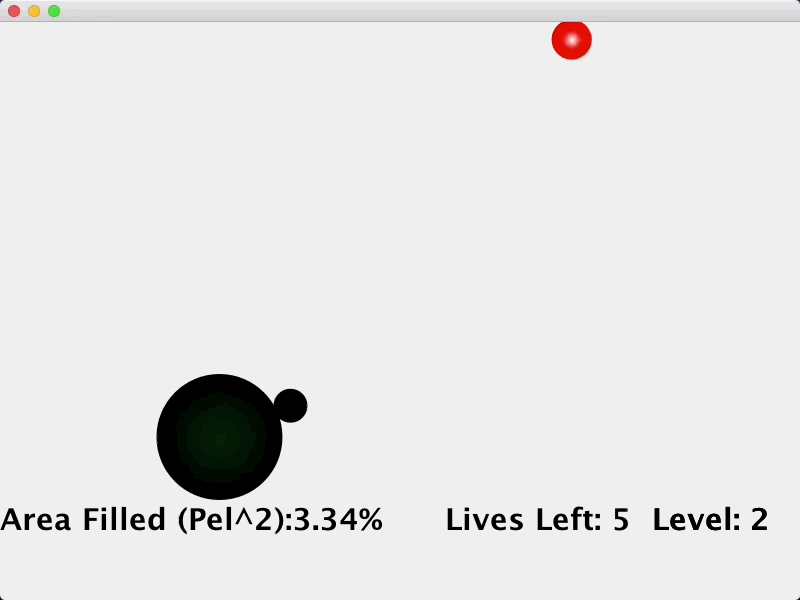
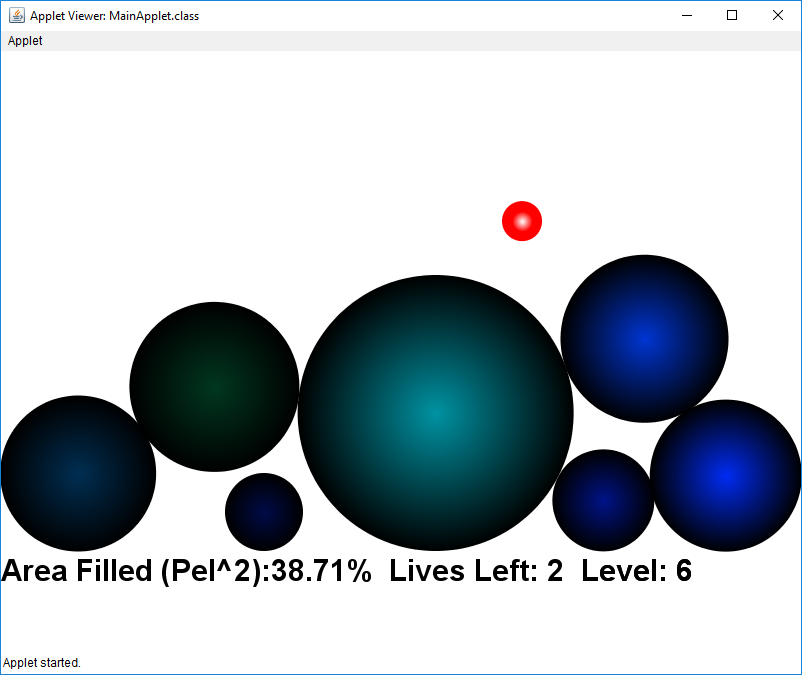
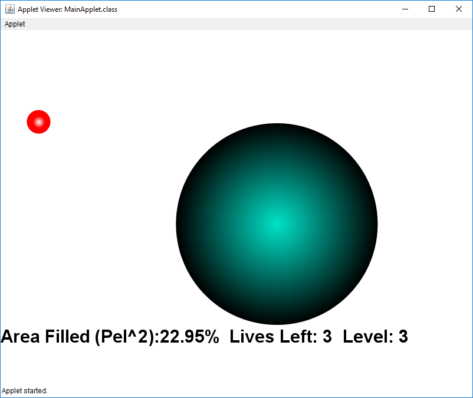

# Super-Fill-up
Classic Super Fill Up game written in Java for project in high school senior computer science final project. Notable features: realistic 2d ball physics and collisions. 

* Most minimal code change done to convert from an Applet to a Frame on 2/7/2020 since Applet was deprecated in Java 9.

## Screenshots

